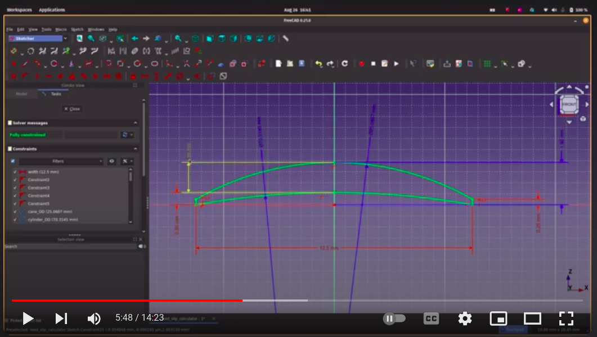
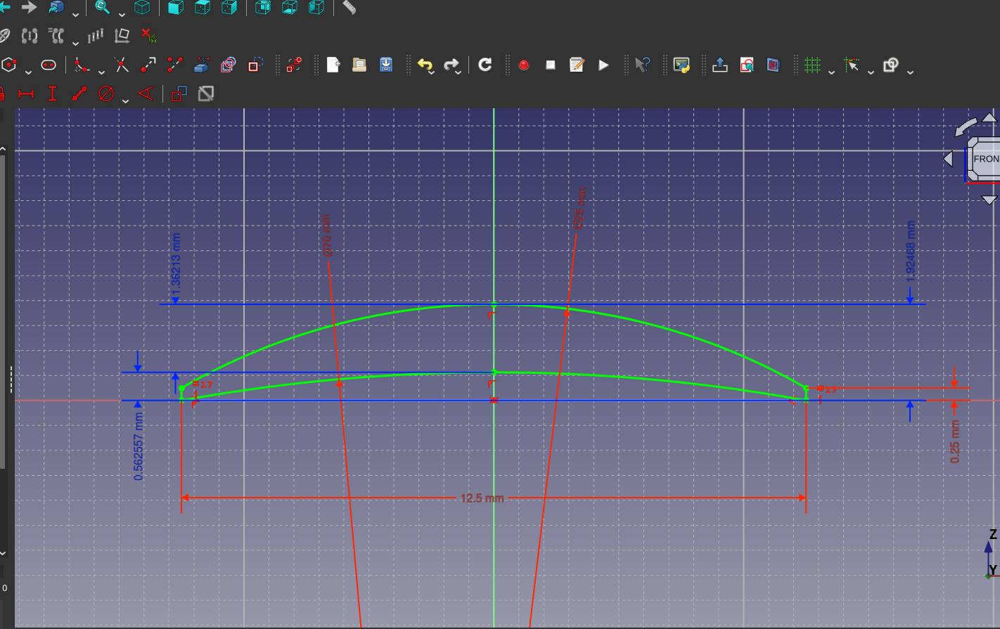
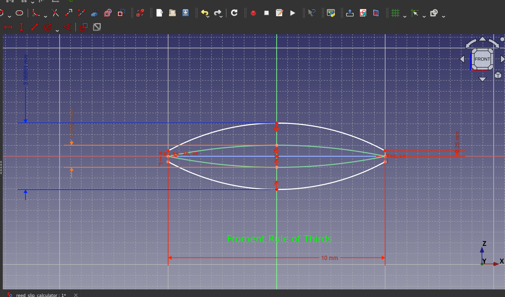

slip-calculator

Use a free and open source CAD software to explore slip geometry interactively.

Learn about and tweak the four parameters that determine a slip: *width, sanding cylinder diameter, cane diameter, and edge thickness*, and calculate dip, centerline thickness, and stature.

Explore the Froment Rule of Thirds, and calculate cane and cylinder ODs required to yield slips that satisfy this geometric condition.

Additionally, if you don't want to download FreeCAD, use included spreadsheets to calculate stature, dip, centerline, and aperture.

# Introduction and Tutorial on Youtube:

# Example Screenshots
## Visualizing and calculating dip, centerline and stature from the four fundamental parameters

## Exploring the Froment Rule of Thirds

# Installation
Install FreeCAD for your OS, clone or download this project as a ZIP if you don't use git, and open
`reed_slip_calculator.FCStd` in FreeCAD.

## Download FreeCAD for any Platform
https://www.freecad.org/downloads.php

## Downloading a GitHub Repository as a ZIP archive
If you don't use `git`, follow the official instructions to <a href=https://docs.github.com/en/repositories/working-with-files/using-files/downloading-source-code-archives alt="download this project as a ZIP archive" target="_blank">download this project as a ZIP archive</a>

# Capabilities
Using this project, you can do the following:

## FreeCAD

- calculate dip and centerline from cane OD, cylinder OD, slip width, and edge thickness
- calculate the cane OD and cylinder OD required to create a certain dip and centerline, given a width and edge thickness
- calculate cane OD that is required to satisfy the Froment Rule of Thirds for a given sanding cylinder OD and width, and calculate the resulting dip and centerline
- calculate cylinder OD that is required to satisfy the Froment Rule of Thirds for a given cane OD and width, and calculate the resulting dip and centerline
- calculate the cane OD required to produce certain centerline, for a given dip, width (and thus sanding cylinder OD), and edge thickness
- calculate the slip width and centerline for a given dip, cylinder OD, cane OD, and edge thickness

## Spreadsheets
- Calculate stature, dip, centerline, and aperture from cane OD, cylinder OD, slip width, and edge thickness
- Calculate the sanding cylinder diameter required to yield a desired dip, given a slip width
- Calculate the sanding cylinder diameter required to yield a desired centerline, given a slip width
    and stature (the latter of which can be calculated from the first spreadsheet for your cane OD,
    or you can measure it directly with calipers)

# Known Limitations
- trying to calculate the width required to satisfy the Rule of Thirds for a given cane and cylinder OD doesn't converge in the solver, and erratic results are obtained
